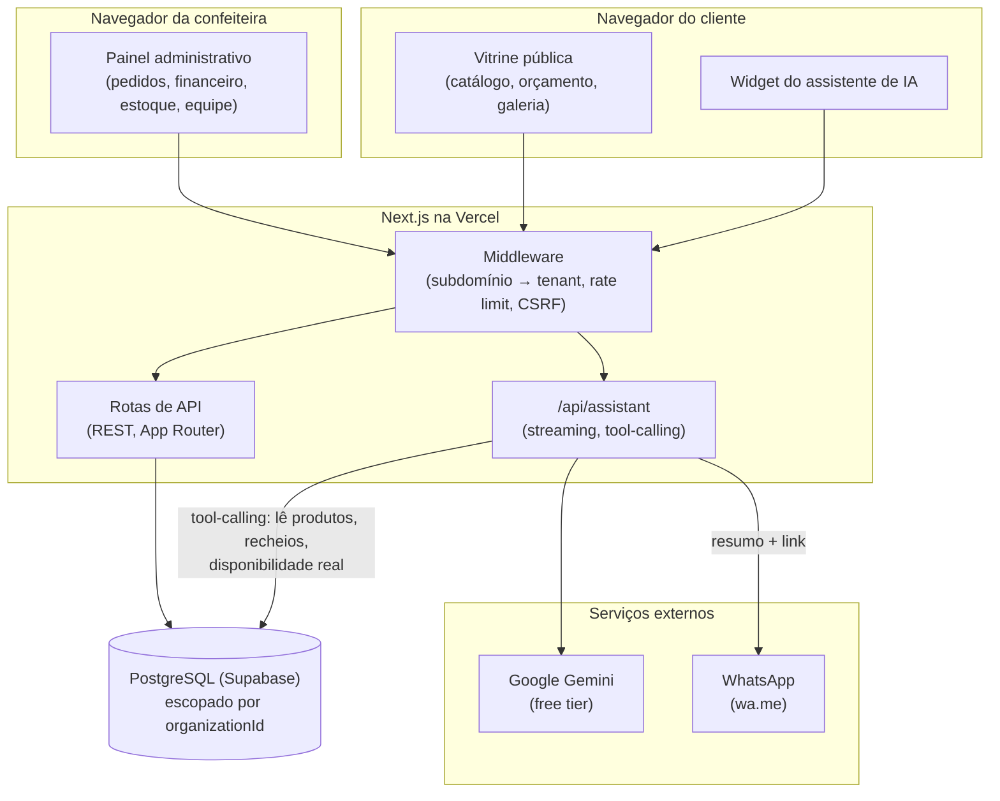

# Arquitetura

## Visão geral

Uma aplicação Next.js (App Router) só, servindo três públicos diferentes sobre a mesma base de código: a vitrine pública, o painel administrativo da confeitaria, e o assistente de IA. Isolamento entre confeitarias (multi-tenant) acontece por subdomínio, resolvido no middleware, e por `organizationId` em toda query ao banco (ver [ADR 0001](adr/0001-multi-tenant-por-subdominio.md)).

## O assistente de IA, em detalhe

O assistente (ver [ADR 0002](adr/0002-assistente-tool-calling-grounded.md), [ADR 0003](adr/0003-gemini-free-tier-sem-ai-gateway.md) e [ADR 0004](adr/0004-assistente-so-tira-duvida-e-encaminha.md)) é hoje **um único agente**, sem sub-agentes, com quatro ferramentas:

| Ferramenta | O que faz | Escreve no banco? |
|---|---|---|
| `listarBolosECategorias` | Lê produtos ativos, preços, variações | Não |
| `listarRecheios` | Lê recheios ativos e acréscimo de preço | Não |
| `verificarDisponibilidade` | Cruza data pedida com `BlockedDate` e prazo mínimo | Não |
| `gerarResumoWhatsApp` | Formata um resumo em link de WhatsApp | Não |

**O que o agente pode fazer:** responder perguntas usando dado real, montar um resumo da conversa.
**O que o agente não pode fazer:** escrever no banco, criar pedido, cobrar, prometer uma data como confirmada -- a palavra final é sempre humana, pelo WhatsApp.
**Onde entra o humano:** em toda decisão que grava algo (confirmar pedido, prazo, pagamento) -- hoje isso acontece inteiramente fora do sistema, na conversa de WhatsApp entre a confeiteira e o cliente.
**O que acontece quando falha:** timeout ou erro do Gemini (cota, indisponibilidade) cai num estado de fallback no próprio widget -- mensagem de erro + botão direto de WhatsApp, nunca uma tela travada ou em branco.

## Limitações conhecidas (aceitas, não ignoradas)

- Rate limiting é em memória, por instância de função -- proteção contra abuso comum, não contra ataque distribuído ([ADR 0005](adr/0005-rate-limiting-centralizado-no-middleware.md)).
- O histórico de conversa enviado pro `/api/assistant` é confiado como veio do cliente, sem revalidação -- um cliente pode forjar um turno anterior do assistente. Impacto limitado à própria conversa dele, sem persistência nem efeito sobre outros visitantes (documentado em `docs/superpowers/specs/2026-09-17-assistente-ia-site-design.md`, seção "Riscos aceitos").
- Conversas do assistente não são persistidas hoje -- não há como auditar depois o que um cliente perguntou e o que o agente respondeu.
