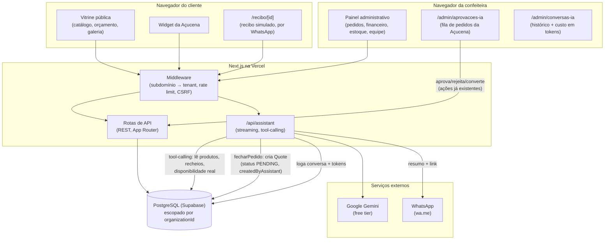

# Arquitetura

## Visão geral

Uma aplicação Next.js (App Router) só, servindo três públicos diferentes sobre a mesma base de código: a vitrine pública, o painel administrativo da confeitaria, e a Açucena (assistente de IA). Isolamento entre confeitarias (multi-tenant) acontece por subdomínio, resolvido no middleware, e por `organizationId` em toda query ao banco (ver [ADR 0001](adr/0001-multi-tenant-por-subdominio.md)).

## A Açucena, em detalhe

A Açucena (ver [ADR 0002](adr/0002-assistente-tool-calling-grounded.md), [ADR 0003](adr/0003-gemini-free-tier-sem-ai-gateway.md), [ADR 0004](adr/0004-assistente-so-tira-duvida-e-encaminha.md) e [ADR 0006](adr/0006-assistente-cria-pedido-sob-aprovacao-humana.md)) é hoje **um único agente**, sem sub-agentes, com cinco ferramentas:

| Ferramenta | O que faz | Escreve no banco? |
|---|---|---|
| `listarBolosECategorias` | Lê produtos ativos, preços, variações | Não |
| `listarRecheios` | Lê recheios ativos e acréscimo de preço | Não |
| `verificarDisponibilidade` | Cruza data pedida com `BlockedDate` e prazo mínimo | Não |
| `gerarResumoWhatsApp` | Formata um resumo em link de WhatsApp | Não |
| `fecharPedido` | Cria um `Quote` real a partir do catálogo (preço sempre recalculado do banco, nunca aceito do modelo) | **Sim** -- sempre `status: 'PENDING'` e `createdByAssistant: true` |

**O que o agente pode fazer:** responder perguntas usando dado real, recomendar produto por necessidade descrita (não só por nome), montar um resumo da conversa, e criar um pedido de verdade para revisão.
**O que o agente não pode fazer:** confirmar um pedido sozinho, cobrar, prometer uma data como confirmada, ou usar qualquer preço que não venha do catálogo -- a palavra final sobre o que vira negócio de verdade é sempre humana.
**Onde entra o humano:** todo `Quote` criado pela Açucena nasce `PENDING` e aparece em `/admin/aprovacoes-ia`; só vira `Order` de verdade quando a confeiteira aprova e converte (mesmas ações que já existiam pra orçamentos criados manualmente). Pagamento é sempre uma ação manual da confeiteira (inclusive o modo "Simulado", usado pra demonstração, sem dinheiro real); o recibo em `/recibo/[id]` é gerado só depois disso, com acesso controlado por número de WhatsApp (mesmo modelo do `/pedido` já existente).
**O que acontece quando falha:** timeout ou erro do Gemini (cota, indisponibilidade) cai num estado de fallback no próprio widget -- mensagem de erro + botão direto de WhatsApp, nunca uma tela travada ou em branco. Se `fecharPedido` falhar (produto/variação não encontrado no catálogo, erro inesperado), a Açucena recebe um erro tratado -- nunca o texto bruto de uma falha interna -- e explica o problema ao cliente com suas próprias palavras, oferecendo o resumo por WhatsApp como alternativa.

## Custo e observabilidade

Toda conversa com a Açucena é registrada (`AssistantConversation` + `AssistantMessage`), incluindo o total de tokens consumidos por conversa -- visível em `/admin/conversas-ia`. Isso cobre tanto a auditoria (o que um cliente perguntou, o que o agente respondeu e fez) quanto o controle de custo (o assistente roda no free tier do Gemini; o registro de tokens é o que permite perceber se o uso real está se aproximando de um limite).

## Limitações conhecidas (aceitas, não ignoradas)

- Rate limiting é em memória, por instância de função -- proteção contra abuso comum, não contra ataque distribuído ([ADR 0005](adr/0005-rate-limiting-centralizado-no-middleware.md)).
- O histórico de conversa enviado pro `/api/assistant` é confiado como veio do cliente, sem revalidação -- um cliente pode forjar um turno anterior do assistente. Isso pode ficar registrado no log da conversa exatamente como enviado, mas não concede nenhuma capacidade além do que o texto em si mostra -- não afeta outros visitantes, nem pula a validação real de `fecharPedido` (preço e catálogo continuam vindo do banco, nunca do histórico).
- `fecharPedido` cobre o caso comum (produto + variação + quantidade); combinações mais elaboradas de personalização a Açucena encaminha pro WhatsApp em vez de tentar montar sozinha, evitando errar o preço por falta de cobertura (ver `docs/superpowers/specs/2026-09-21-acucena-agente-vendas-design.md`, seção "Riscos aceitos").
- O acesso ao recibo (`/recibo/[id]`) depende de conhecer o WhatsApp cadastrado no pedido, não de uma senha -- consistente com o nível de segurança que `/pedido` já tinha, não uma regressão nova.
